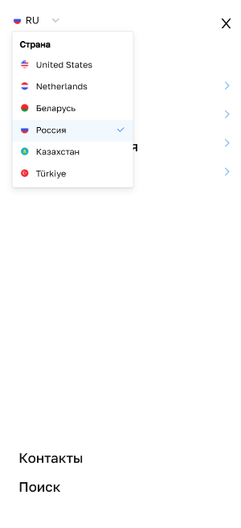
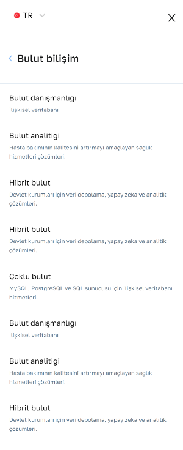

# О проекте:

Этот проект - это приложение на React + Redux Toolkit, предоставляющее многоуровневое, адаптивное и функциональное меню. Оно позволяет пользователям просматривать и взаимодействовать с информацией об услугах и облачных вычислениях. В меню доступы 6 языков: Русский, Английский, Турецкий, Белорусский, Казахский и Нидерландский. В проекте так же используются различные компоненты и хуки для обработки получения данных, фильтрации и отображения.

<h2>
Посмотреть сайт можно по 👉 
<a href="https://magical-hamster-9cb444.netlify.app/">ссылке</a>
</h2>

 

# Иллюстрация к проекту

| Меню не активно | Меню активно | Выбор языка |
| :--------------:|:-----------:|:-----------:|
|  |  |  |

 

| Услуги | Облачные вычисления |
| :-----:|:-------------------:|
|  |  |

# Технологии:
👉 React JS  
👉 Redux Toolkit   
👉 SCSS
